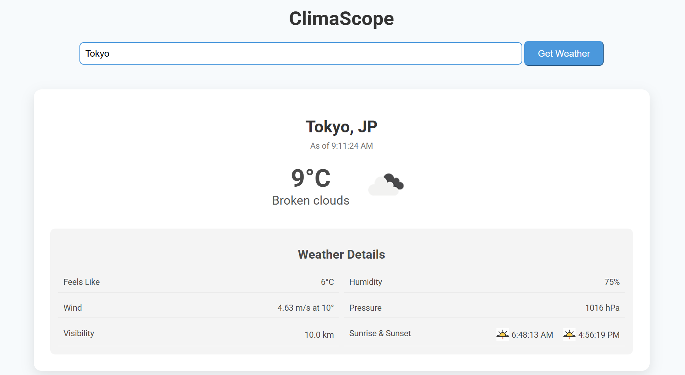

# <h1 align="center">ClimaScope</h1>

**A sleek and interactive application to view real-time weather updates and timezone-based local time for any city worldwide.**

 

---

## Project Description

**ClimaScope** simplifies weather forecasting by providing users with real-time weather updates, including temperature, humidity, wind speed, and more. Alongside weather details, it shows the current local time in the selected city with support for time zones like IST, EST, etc., making it a versatile tool for travelers, businesses, or anyone curious about global weather and time.

---

## Table of Contents

- [Project Title and Overview](#climascope-weather-forecast-and-timezone-app)
- [Project Description](#project-description)
- [Features](#features)
- [Technology Stack](#technology-stack)
- [Preview](#preview)
- [Installation](#installation)
- [Usage](#usage)
- [Configuration](#configuration)
- [Testing](#testing)
- [License](#license)
- [FAQs](#faqs)
- [Contact Information](#contact-information)

---

## Features

- Fetch real-time weather data for any city worldwide.
- Display local time in multiple time zones (e.g., IST, EST).
- Interactive and responsive user interface for a seamless experience.
- Easy-to-use input form for selecting cities.
- Error handling for invalid city inputs or API issues.

---

## Technology Stack

**Frontend**:
- HTML5, CSS3, JavaScript (ES6)
- Bootstrap for responsive design

**Backend**:
- Node.js (for API interaction)
- OpenWeatherMap API (for weather data)

---

## Preview

Below is the preview of **ClimaScope** in action:




---

## Installation

To set up **ClimaScope** locally, follow these steps:

1. Clone the repository:
    ```bash
    git clone https://github.com/ThakkarVidhi/weather-by-city-time.git
    cd weather-by-city-time
    ```

2. Install the necessary dependencies:
    ```bash
    npm install
    ```

3. Obtain an API key from [OpenWeatherMap](https://openweathermap.org/api) and update the `.env` file:
    ```javascript
    const OPENWEATHER_API_KEY = "your_api_key_here";
    ```

4. Start the application:
    ```bash
    npm start
    ```

5. Open `http://localhost:3000/` in your browser to use the app.

---

## Usage

**Steps to Use ClimaScope:**

1. Enter the name of a city in the search bar.
2. Click "Get Weather" to view real-time weather data and the local time.
3. The app will display:
   - Temperature, humidity, wind speed, and weather conditions.
   - Local time with the city's timezone.

---

## Configuration

This project uses a `.env` file for managing API keys. Update the following key before running the app:

### Configuration Settings:
- **OPENWEATHER_API_KEY**: Add your OpenWeatherMap API key.

---

## Testing

To test the functionality of **ClimaScope**, follow these steps:

1. Open the application in your browser.
2. Enter a valid city name and verify the weather and time displayed.
3. Test error handling by entering invalid city names.

---

## License

This project is licensed under the [MIT License](LICENSE).  


---

## FAQs

**Q: What happens if I enter an invalid city name?**  
**A:** The app will display an error message stating that the city was not found.

**Q: Can I change the temperature unit (e.g., Celsius to Fahrenheit)?**  
**A:** The current version supports Celsius by default. You can modify the code in the weather API call to include the `units` parameter.

**Q: What should I do if the time does not display correctly?**  
**A:** Ensure that the city name is entered correctly.

**Q: Can I add additional weather metrics?**  
**A:** Yes, you can extend the API call to include additional metrics and modify the UI accordingly.

---

## Contact Information

For any questions or feedback, feel free to reach out:  
📧 **[vidhithakkar.ca@gmail.com](mailto:vidhithakkar.ca@gmail.com)**  
🌐 **[LinkedIn](https://www.linkedin.com/in/vidhi-thakkar-0b509724a/)**